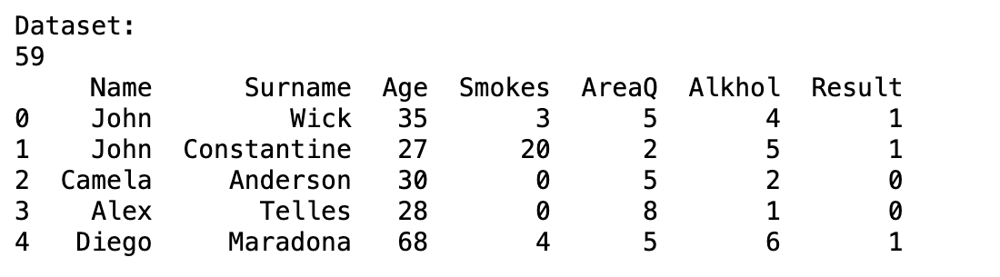
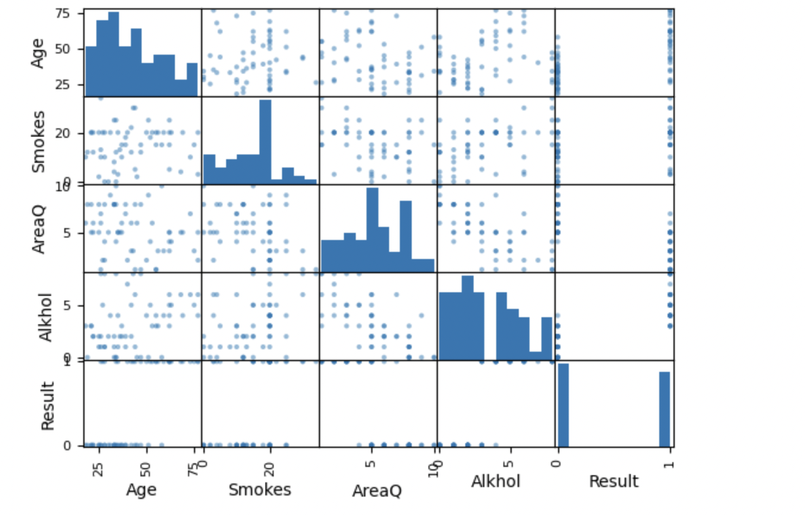
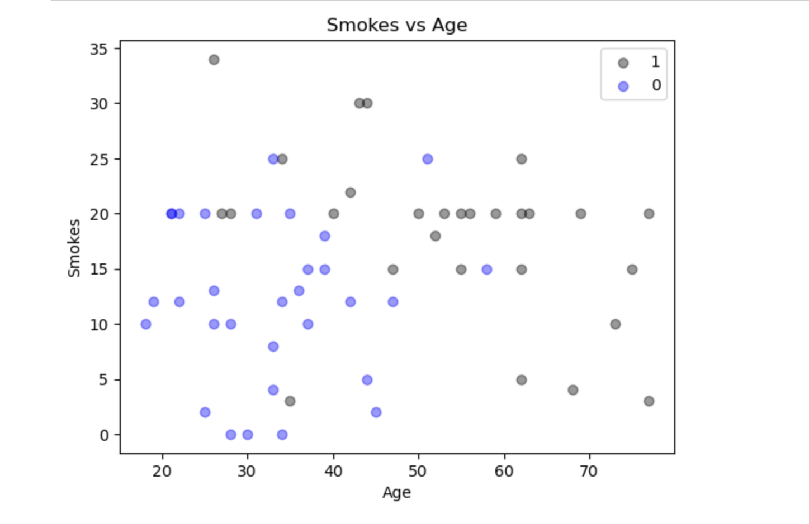
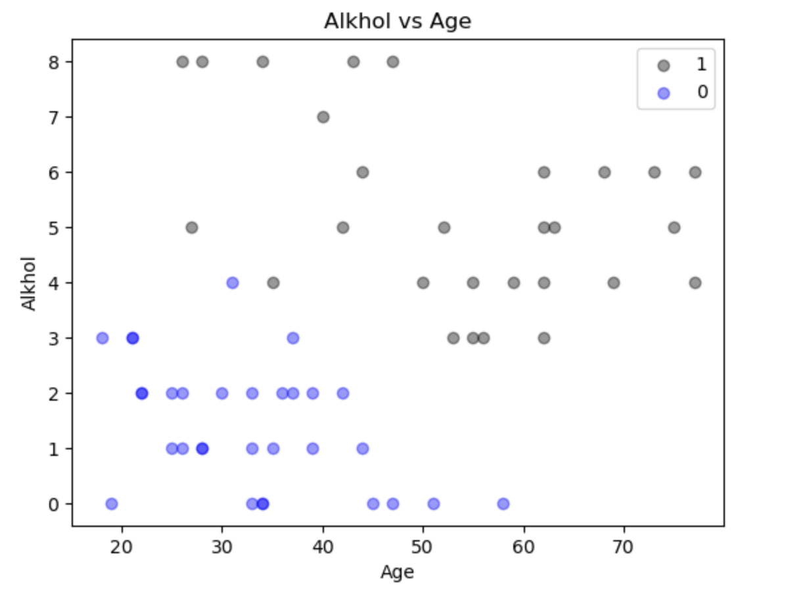
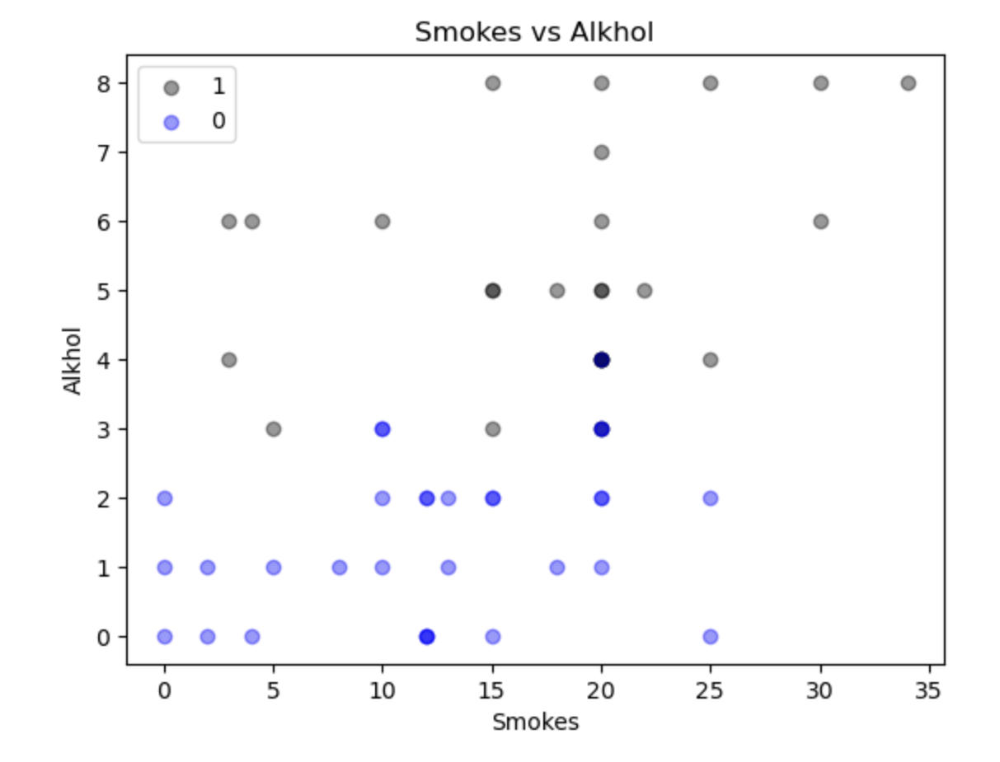
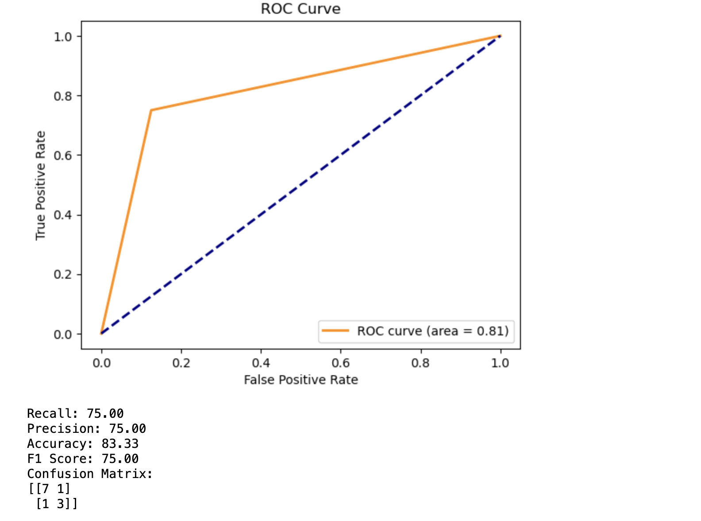

# <u>Lung Cancer Detection Using Machine Learning </u>

### <u>Introduction</u>
I am delving into the critical issue of lung cancer, a major contributor to global mortality with a survival rate of only 10-16% over five years. Smoking poses the highest risk, but even non-smokers can be affected. The longer and more one smokes, the higher the risk. Quitting significantly lowers the chance of developing lung cancer.

In my project, I employ machine learning algorithms to diagnose and initiate treatment for cancer in its early stages. As we anticipate a rise in preventive measures, scientists are developing computerized solutions to aid doctors, enhance diagnostic precision, expedite analysis, and cut medical costs. Detecting malignant nodules involves recognizing and measuring specific features. Assessing cancer probability is challenging, even for experienced medical professionals, due to the complex relationship between nodule presence and positive cancer diagnosis.

I utilize KNN and Decision Tree algorithms to predict cancer accuracy. Employing scikit-learn libraries like sk-learn and pandas, I predict and classify lung cancer patient datasets. Slicing the dataset and employing feature scaling options optimize the dataset training process. Subsequently, I use tools such as the confusion matrix, F1 score, and accuracy score to predict result accuracy.

## <u>Objectives</u>

This project focuses on achieving superior accuracy in identifying lung cancer patients, addressing the urgent need for early detection of this highly fatal cancer. To meet this goal, i utilize the KNeighbors Classifier and Decision Tree algorithm for classification, optimizing their capabilities on the provided dataset.

Using machine learning techniques, our objective is to categorize individuals based on their lung cancer status, leveraging the 'Result' attribute in the dataset. A 'Result' value of 0 indicates the absence of lung cancer, while a value of 1 signifies its presence.

##  <u>Background</u>

To perform KN algorithm and Decision Tree algorithm i use scikit-learn library. In the background of this project, used libraries are given below-:

**Numpy** - NumPy is a python library used for working with arrays. It also has functions for working in domain of linear algebra, fourier transform, and matrices.

***Pandas*** - Pandas is a high-level data manipulation tool developed by Wes McKinney. It is built on the Numpy package and its key data structure is called the DataFrame. DataFrames allow you to store and manipulate tabular data in rows of observations and columns of variables.

***Sklearn*** - Scikit-learn is a free machine learning library for Python. It features various algorithms like support vector machine, random forests, and k-neighbours, and it also supports Python numerical and scientific libraries like NumPy and Scily.

***KNeighbors Classifier*** - KNN is a non-parametric and lazy learning algorithm. Non-parametric means there is no assumption for underlying data distribution. All training data usedin the testing phase. This makes training faster and testing phase slower and costlier. Costly testing phase means time and memory.

***Decision Tree*** - DTs are a non-parametric supervised learning method used for classification and regression. The goal is to create a model that predicts the value of a target variable by learning simple decision rules inferred from the data features.

**Dataset Information**  
The dataset contains 61 instances and 5 attributes which are-
Attributes Information-

- Age
- Smokes
- AreaQ
- Alcohol
- Result(0,1)

## <u>Screenshots</u>

## <u>Output</u>

## <u>Future Scope:</u>

The lung cancer detection system utilizing machine learning techniques is highly efficient and provides improved results for radiologists, aiding in accurate patient detection. This system can be further enhanced with additional features to support radiologists and improve overall performance.

Machine learning plays a crucial role in enabling Artificial Intelligence, marking the future of healthcare. The healthcare sector is becoming increasingly data-driven, leveraging big data and machine learning to bring about significant advancements. These technologies not only enhance treatment and diagnosis options but also empower individuals to take control of their health through access to smarter healthcare.

## <u>Conclusion:</u>
In this study, i processed the dataset to differentiate affected patients and determine the level of cancer growth using a machine learning system. The approach presented here aims to achieve the best accuracy in cancer diagnosis, assisting radiologists and paving the way for future enhancements. Future work should focus on improving classification accuracy through experiments with various alternatives.

Benchmarking the most performing architectures on available datasets using similar metrics can facilitate comparative analysis. One current limitation is the imbalanced nature of the data. The incorporation of new loss functions, designed to address the issue of unbalanced classes, such as focal loss, could enhance existing results and contribute to more efficient training.

With an increased dataset and improved data balance, better results can be achieved. This highlights the potential for continued advancements in lung cancer detection and the importance of ongoing research to refine and optimize machine learning models for enhanced healthcare outcomes.
 
## <u>References</u>
- Dataset - Lung Cancer Dataset  (https://www.kaggle.com/datasets/yusufdede/lung-cancer-dataset?resource=download)
Machine Learning Journal .
- ML Algorithms (https://machinelearningmastery.com)
- Scikit-Learn Library (scikit-learn.org)
- Lung Cancer Detection (www.kaggle.com)
- UCI Machine Learning repository (https://archive.ics.uci.edu/ml/index.php)
- Matplotlib Module (https://matplotlib.org/)

